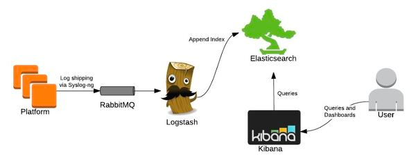
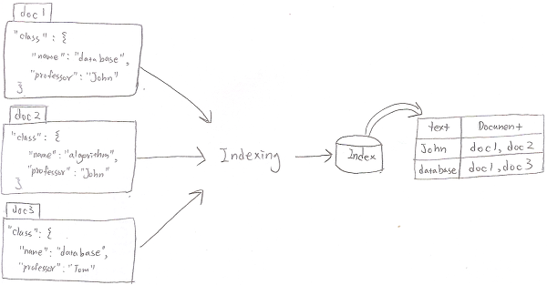
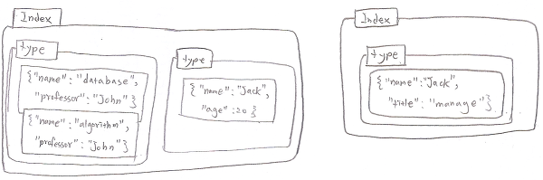
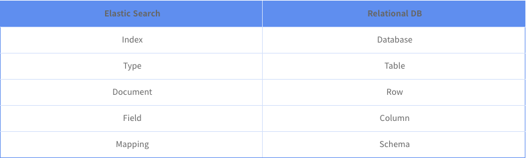
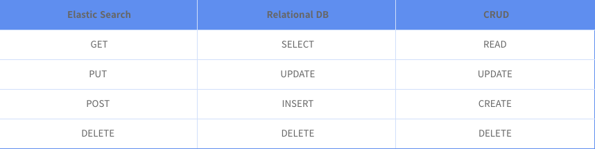

# ELK스택

ElasticSearch를 실습하기 전에 ELK스택에 대해 알아보겠습니다. 데이터과학은 깊고 넓은 분야입니다. 분야가 다양하기때문에 데이터과학은 각 분야의 팀워크가 생명입니다. 아래는 데이터 과학을 구성하는 각각의 영역을 다이어그램으로 나타낸 그림입니다.


빅데이터 개발자는 어떤 데이터이든지 수집하고 빠르게 검색하고 데이터 무더기에서 쓸만한 정보를 보기좋게 시각화 할수 있어야 합니다. 오픈소스를 이용해 어떤 운영체제를 만나도 운영 가능하도록, 만약 ELK 스택을 마스터한다면, 어떤 빅데이터를 만나도 쉽게 관련 개발을 할 수 있습니다.




위 그림은 특정 로그를 수집하고 이를 시각화하는 전체 구조를 도식화 한 것입니다. Logstash는 데이터베이스에 무관하게 어떠한 데이터든지 수집해주는 역할을 합니다. Kibana는 visualization 툴로 elasticSearch 데이터를 보기좋게 화면에 뿌려주는 기능을 합니다. 다음은 Elastc Search의 기본적인 Data Flow입니다.




Elastic Search는 키워드가 어떤 Document에 있다고 저장하는 방식입니다. 해쉬테이블방식이여서 BigO 표기법에 따르면 검색시, O(1)의 효과를 냅니다. 반면 Relational DB의 경우, 텍스트 검색시 문서 개수만큼 연산이 수행되기때문에 O(n)의 빅오 노테이션을 같습니다. 다음은 Elastic Search Data Structure 구조를 나타낸 그림입니다. document들은 같은 property를 가지고 있다는 것을 확인할 수 있습니다.





다음은 Elastic Search와 Relational DB를 비교한 표이고, 개념이 이런식으로 매핑된다고 이해하면 좋을 것 같습니다.





또한, ElasticSearch를 REST API를 사용하여 관계형 데이터베이스간 관계를 나타내면 다음과 같습니다.





# Elastic Search를 설치하기

이제 ElasticSearch에 대하여 간단한 실습 진행해보겠습니다. 아래 내용은 인프런 ELK 스택 강의에 기반한 실습 내용을 정리한 것입니다. Elastic Search를 사용하기 위해서는 반드시 JVM 설치가 필요합니다. 왜냐하면 elastic search는 jvm 위에서 돌아가기 때문입니다.


### 1. java 8 인스톨


```shell
sudo add-apt-repository -y ppa:webupd8team/java

sudo apt-get update

sudo apt-get -y install oracle-java8-installer
```


add-apt-repository 명령어가 동작을 안한다면,

apt-get install python-software-properties

sudo apt-get install software-properties-common

를 실행하여, 관련 패키지를 설치합니다.


### 2. ElasticSearch 인스톨


```shell
wget https://artifacts.elastic.co/downloads/elasticsearch/elasticsearch-5.3.1.deb

dpkg -i elasticsearch-5.1.1.deb
```

설치 경로 : /usr/share/elasticsearch

설정파일 경로 : /etc/elasticsearch

스크립트 파일 : /etc/init.d/elasticsearch


```shell
sudo systemctl enable elasticsearch.service (자동 재시작)
```


```shell
service elasticsearch start

service elasticsearch stop

curl -XGET 'localhost:9200' (elasticsearch 작동여부 확인)
```


# 데이터 입력, 조회 및 삭제 (GET, POST, PUT, DELETE)


### 1. 입력전에 데이터가 있는지 없는지를 살핀다.


```shell
curl -XGET http://localhost:9200/classes
```


결과를 예쁘게 보는 방법 입니다.
```shell
curl -XGET http://localhost:9200/classes?pretty
```


### 2. 404 결과가 나왔고 해당 인덱스가 없으니 인덱스를 새로 생성한다.

```shell
curl -XPUT http://localhost:9200/classes
```

인덱스가 생성되었는지 확인합니다.

```shell
curl -XGET http://localhost:9200/classes
```

### 3. 인덱스를 지우는 방법

```shell
curl -XDELETE http://localhost:9200/classes
```

인덱스가 지워졌는지 확인합니다.

```shell
curl -XGET http://localhost:9200/classes
```

### 4. document 생성 방법

document는 index가 있을때 만들어도 되고, index가 없을때도 index명과 type명을 명시해주면 바로 document 생성이 가능합니다.

```shell
curl -XPOST http://localhost:9200/classes/class/1/ -d '{"title":"Algorithm", "professor":"John"}'
```

document가 파일에 저장되어 있을 경우(항상 커맨드에 입력할 수는 없습니다)

```shell
curl -XPOST http://localhost:9200/classes/class/1/ -d @<파일명.json>
```

# Elastic 데이터 업데이트


### 1. 업데이트할 document를 하나 생성

```shell
curl -XPOST http://localhost:9200/classes/class/1/ -d '{"title":"Algorithm","professor":"John"}'

curl -XGET http://localhost:9200/classes/class/1?pretty
{
    "_index" : "classes",
    "_type" : "class",
    "_id" : "1",
    "_version" : 2,
    "found" : true,
    "_source" : {
        "title" : "Algorithm",
        "professor" : "John"
    }
}
```

### 2. 이제 만들어진 document를 수정합니다
```shell
curl -XPOST http://localhost:9200/classes/class/1/_update?pretty -d '{"doc":{"unit":1}}'
curl -XPOST http://localhost:9200/classes/class/1/_update?pretty -d '{"doc":{"unit":1}}'
{
    "_index" : "classes",
    "_type" : "class",
    "_id" : "1",
    "_version" : 3,
    "result" : "updated",
    "_shards" : {
        "total" : 2,
        "successful" : 1,
        "failed" : 0
    }
}

curl -XPOST http://localhost:9200/classes/class/1/_update?pretty -d '{"doc":{"unit":2}}'
curl -XPOST http://localhost:9200/classes/class/1/_update?pretty -d '{"doc":{"unit":2}}'
{
    "_index" : "classes",
    "_type" : "class",
    "_id" : "1",
    "_version" : 4,
    "result" : "updated",
    "_shards" : {
        "total" : 2,
        "successful" : 1,
        "failed" : 0
    }
}
```

스크립트를 이용하여 업데이트하는 방법
```shell
curl -XPOST http://localhost:9200/classes/class/1/_update?pretty -d '{"script":"ctx._source.unit+=5"}'
{
    "_index" : "classes",
    "_type" : "class",
    "_id" : "1",
    "_version" : 5,
    "result" : "updated",
    "_shards" : {
        "total" : 2,
        "successful" : 1,
        "failed" : 0
    }
}
```

# 엘라스틱서치 - 벌크(Bulk)

벌크란 여러개의 document를 한번에 elastic search에 삽입하는 방법입니다.

CLASSES.JSON (BULK FILE)

```shell
curl -XPOST http://localhost:9200/_bulk?pretty --data-binary @/home/elasticSearch/test/bulk.json

root@5f758cdf11c7:/home/elasticSearch/test# curl -XGET localhost:9200/classes/class/1?pretty
{
    "_index" : "classes",
    "_type" : "class",
    "_id" : "1",
    "_version" : 6,
    "found" : true,
    "_source" : {
        "title" : "Machine Learning",
        "Professor" : "Minsuk Heo",
        "major" : "Computer Science",
        "semester" : [
          "spring",
          "fall"
        ],
        "student_count" : 100,
        "unit" : 3,
        "rating" : 5,
        "submit_date" : "2016-01-02",
        "school_location" : {
          "lat" : 36.0,
          "lon" : -120.0
        }
    }
}
```

```shell
root@5f758cdf11c7:/home/elasticSearch/test# curl -XGET localhost:9200/classes/class/2?pretty
{
    "_index" : "classes",
    "_type" : "class",
    "_id" : "2",
    "_version" : 1,
    "found" : true,
    "_source" : {
        "title" : "Network",
        "Professor" : "Minsuk Heo",
        "major" : "Computer Science",
        "semester" : [
          "fall"
        ],
        "student_count" : 50,
        "unit" : 3,
        "rating" : 4,
        "submit_date" : "2016-02-02",
        "school_location" : {
          "lat" : 36.0,
          "lon" : -120.0
        }
    }
}
```

# 엘라스틱서치 매핑(Mapping)

매핑은 관계형데이터베이스에서 스키마 개념과 동일합니다. 매핑없이 elastic search에 데이터를 넣을 수 있을까요? 가능은 하지만, 매핑없이 데이터를 넣는것은 매우 위험합니다. 데이터에 날짜를 넣는데 그게 날짜인지 아닌지 모릅니다. 타입형에서도 혼선이 올 수 있습니다. Kibana로 시각화 할때 date 타입으로 보여주고 싶어도 형이 안맞으면 적절한 출력이 안될 수도 있습니다.

#### 데이터 관리시에는 매핑을 먼저 추가하고, 데이터가 이미 있을때는 매핑을 추후에 추가하여, 분석이나 시각화할때 도움이 될 수 있습니다.

데이터 매핑을 지정하는 방법은 다음과 같습니다.

```shell
{
    "class":{
		"properties":{
			"title":{"type":"string"},
			"professor":{"type":"string"},
			"major":{"type":"string"},
			"semester":{"type":"string"},
			"student_count":{"type":"integer"},
			"unit":{"type":"integer"},
			"rating":{"type":"integer"},
			"submit_date":{"type":"date","format":"yyyy-MM-dd"},
			"school_location":{"type":"geo_point"}
		}
	}
}
```

geo_point의 경우, 해당 타입을 시각화툴을 이용하면 지도위에다가 바로 위치 표시가 가능합니다.


### 1. 매핑을 지정할 인덱스를 하나 생성합니다.

```shell
curl -XPUT 'http://localhost:9200/mapping'
{"acknowledged":true,"shards_acknowledged":true}

curl -XGET http://localhost:9200/mapping?pretty
{
    "mapping" : {
        "aliases" : { },
        "mappings" : { },
        "settings" : {
          "index" : {
            "creation_date" : "1498040974696",
            "number_of_shards" : "5",
            "number_of_replicas" : "1",
            "uuid" : "a-rZSP87THysGZvdhtR3sg",
            "version" : {
              "created" : "5030199"
            },
            "provided_name" : "mapping"
          }
        }
    }
}
```

매핑영역이 비어있는걸 알 수 있습니다.


### 2. 매핑을 지정합니다.

```shell
curl -XPUT 'http://localhost:9200/mapping/class/_mapping' -d @/home/elasticSearch/test/mappingTest.json
{"acknowledged":true}

curl -XGET http://localhost:9200/mapping?pretty
{
    "mapping" : {
        "aliases" : { },
        "mappings" : {
          "class" : {
            "properties" : {
              "major" : {
                "type" : "text"
              },
              "professor" : {
                "type" : "text"
              },
              "rating" : {
                "type" : "integer"
              },
              "school_location" : {
                "type" : "geo_point"
              },
              "semester" : {
                "type" : "text"
              },
              "student_count" : {
                "type" : "integer"
              },
              "submit_date" : {
                "type" : "date",
                "format" : "yyyy-MM-dd"
              },
              "title" : {
                "type" : "text"
              },
              "unit" : {
                "type" : "integer"
              }
            }
          }
        },
        "settings" : {
          "index" : {
            "creation_date" : "1498040974696",
            "number_of_shards" : "5",
            "number_of_replicas" : "1",
            "uuid" : "a-rZSP87THysGZvdhtR3sg",
            "version" : {
              "created" : "5030199"
            },
            "provided_name" : "mapping"
          }
        }
    }
}
```

이런식으로 mapping 영역을 지정하면, aggregation이나 시각화할때 적절한 결과를 도출할 수 있습니다.


### 3. bulk 기능을 사용하여 해당 인덱스에 데이터를 입력합니다.


```shell
curl -XPOST http://localhost:9200/_bulk?pretty --data-binary @/home/elasticSearch/test/bulk.json
```

데이터가 잘 들어갔는지 확인합니다.

```shell
curl -XGET http://localhost:9200/classes/class/1/?pretty
{
    "_index" : "classes",
    "_type" : "class",
    "_id" : "1",
    "_version" : 7,
    "found" : true,
    "_source" : {
        "title" : "Machine Learning",
        "Professor" : "Minsuk Heo",
        "major" : "Computer Science",
        "semester" : [
          "spring",
          "fall"
        ],
        "student_count" : 100,
        "unit" : 3,
        "rating" : 5,
        "submit_date" : "2016-01-02",
        "school_location" : {
          "lat" : 36.0,
          "lon" : -120.0
        }
    }
}
```

# 엘라스틱서치 데이터 조회(Search)

### 1. elasticSearch에 샘플 데이터를 입력합니다.

```shell
curl -XPOST 'localhost:9200/_bulk' --data-binary @simple_basketball.json

{"took":172,"errors":false,"items":[{"index":{"_index":"basketball","_type":"record","_id":"1","_version":1,"result":"created","_shards":{"total":2,"successful":1,"failed":0},"created":true,"status":201}},{"index":{"_index":"basketball","_type":"record","_id":"2","_version":1,"result":"created","_shards":{"total":2,"successful":1,"failed":0},"created":true,"status":201}}]}
```

```shell
curl -XGET localhost:9200/basketball/record/_search?pretty
{
    "took" : 45,
    "timed_out" : false,
    "_shards" : {
        "total" : 5,
        "successful" : 5,
        "failed" : 0
    },
    "hits" : {
        "total" : 2,
        "max_score" : 1.0,
        "hits" : [
          {
            "_index" : "basketball",
            "_type" : "record",
            "_id" : "2",
            "_score" : 1.0,
            "_source" : {
              "team" : "Chicago Bulls",
              "name" : "Michael Jordan",
              "points" : 20,
              "rebounds" : 5,
              "assists" : 8,
              "submit_date" : "1996-10-11"
            }
          },
          {
            "_index" : "basketball",
            "_type" : "record",
            "_id" : "1",
            "_score" : 1.0,
            "_source" : {
              "team" : "Chicago Bulls",
              "name" : "Michael Jordan",
              "points" : 30,
              "rebounds" : 3,
              "assists" : 4,
              "submit_date" : "1996-10-11"
            }
          }
        ]
    }
}
```

### 2. 데이터가 들어간 인덱스로부터 데이터를 조회합니다.

search 옵션 중에 uri 옵션이 존재합니다.

```shell
curl -XGET 'localhost:9200/basketball/record/_search?q=points:30&pretty'
{
    "took" : 37,
    "timed_out" : false,
    "_shards" : {
        "total" : 5,
        "successful" : 5,
        "failed" : 0
    },
    "hits" : {
        "total" : 1,
        "max_score" : 1.0,
        "hits" : [
          {
            "_index" : "basketball",
            "_type" : "record",
            "_id" : "1",
            "_score" : 1.0,
            "_source" : {
              "team" : "Chicago Bulls",
              "name" : "Michael Jordan",
              "points" : 30,
              "rebounds" : 3,
              "assists" : 4,
              "submit_date" : "1996-10-11"
            }
          }
        ]
    }
}
```

다음은 request body를 이용한 search 방법입니다. -d(direct) 옵션을 주어 직접적으로 request body를 지정합니다.

```shell
curl -XGET 'localhost:9200/basketball/record/_search?pretty' -d '{"query":{"term":{"points":30}}}'
{
    "took" : 2,
    "timed_out" : false,
    "_shards" : {
        "total" : 5,
        "successful" : 5,
        "failed" : 0
    },
    "hits" : {
        "total" : 1,
        "max_score" : 1.0,
        "hits" : [
          {
            "_index" : "basketball",
            "_type" : "record",
            "_id" : "1",
            "_score" : 1.0,
            "_source" : {
              "team" : "Chicago Bulls",
              "name" : "Michael Jordan",
              "points" : 30,
              "rebounds" : 3,
              "assists" : 4,
              "submit_date" : "1996-10-11"
            }
          }
        ]
    }
}
```


request body에는 여러가지 옵션이 존재합니다. 자세히 살펴보려면 아래 document 문서를 확인합니다.

https://www.elastic.co/guide/en/elasticsearch/reference/current/search-request-body.html


# 메트릭 어그리게이션(Metric Aggregation)

## Metric Aggregation이란?

elastic search안에 있는 document 안에서 조합을 통해서 어떠한 값을 도출할때 쓰이는 방법으로 그 중 metric aggregations는 산술할 때 쓰입니다. 예를 들면 최댓값, 최솟값, 평균값 등을 구할때 이용합니다.

### 다음은 aggregation의 포맷입니다.
```shell
"aggregations" : {
	"<aggregation_name>" : {
		"<aggregation_type>" : {
		}
		[,"meta":{[<meta_data_body>]}]?
		[,"aggregations":{[<sub_aggregation>]+}]}]?
	}
	[, "<aggregation_name_2>":{...}]*
}
```

### 1. 평균값을 구하는 aggregation 설정 파일(avg_points_aggs.json) 내용을 살펴보겠습니다.
```shell
{
        "size":0,	// 보고싶은 값만 보고 싶을때.
        "aggs":{
                "avg_score":{
                        "avg":{"field":"points"}	// 필드값 중 points에 대한 평균값
                }
        }
}
```

```shell
curl -XGET localhost:9200/_search?pretty --data-binary @avg_points_aggs.json
{
    "took" : 34,
    "timed_out" : false,
    "_shards" : {
        "total" : 20,
        "successful" : 20,
        "failed" : 0
    },
    "hits" : {
        "total" : 27,
        "max_score" : 0.0,
        "hits" : [ ]
    },
    "aggregations" : {
        "avg_score" : {
          "value" : 25.0
        }
    }
}
```

### 2. 최댓값을 구하는 aggregation 설정 파일(max_points_aggs.json) 입니다.

```shell
{
        "size":0,
        "aggs":{
                "max_score":{"max":{"field":"points"} }
        }
}
```

```shell
curl -XGET localhost:9200/_search?pretty --data-binary @max_points_aggs.json
{
    "took" : 11,
    "timed_out" : false,
    "_shards" : {
        "total" : 20,
        "successful" : 20,
        "failed" : 0
    },
    "hits" : {
        "total" : 27,
        "max_score" : 0.0,
        "hits" : [ ]
    },
    "aggregations" : {
        "max_score" : {
          "value" : 30.0
        }
    }
}
```

### 3. 최솟값을 구하는 aggregation 설정 파일(min_points_aggs.json) 입니다.

```shell
{
        "size":0,
        "aggs":{
                "min_score":{"min":{"field":"points"}}
        }
}
```

```shell
curl -XGET localhost:9200/_search?pretty --data-binary @min_points_aggs.json
{
    "took" : 10,
    "timed_out" : false,
    "_shards" : {
        "total" : 20,
        "successful" : 20,
        "failed" : 0
    },
    "hits" : {
        "total" : 27,
        "max_score" : 0.0,
        "hits" : [ ]
    },
    "aggregations" : {
        "min_score" : {
          "value" : 20.0
        }
    }
}
```

### 4. 합계를 구하는 aggregation 설정 파일(sum_points_aggs.json) 입니다.

```shell
{
        "size":0,
        "aggs":{
                "sum_score":{"sum":{"field":"points"}}
        }
}
```

```shell
curl -XGET localhost:9200/_search?pretty --data-binary @sum_points_aggs.json
{
    "took" : 6,
    "timed_out" : false,
    "_shards" : {
        "total" : 20,
        "successful" : 20,
        "failed" : 0
    },
    "hits" : {
        "total" : 27,
        "max_score" : 0.0,
        "hits" : [ ]
    },
    "aggregations" : {
        "sum_score" : {
          "value" : 50.0
        }
    }
}
```

### 5. 다음은 위에서 수행한 모든 계산값들을 한번에 구하는 방법(stats_points_aggs.json)입니다.

```shell
{
        "size":0,
        "aggs":{"stats_score":{"stats":{"field":"points"}}}
}
```

```shell
curl -XGET localhost:9200/_search?pretty --data-binary @stats_points_aggs.json
{
    "took" : 13,
    "timed_out" : false,
    "_shards" : {
        "total" : 20,
        "successful" : 20,
        "failed" : 0
    },
    "hits" : {
        "total" : 27,
        "max_score" : 0.0,
        "hits" : [ ]
    },
    "aggregations" : {
        "stats_score" : {
          "count" : 2,
          "min" : 20.0,
          "max" : 30.0,
          "avg" : 25.0,
          "sum" : 50.0
        }
    }
}
```

# 버켓 어그리게이션(Bucket Aggregation)

엘라스틱서치에서 어그리게이션이란 document 안의 값들을 조합해서 나타내고자 할때 쓰이는 기법입니다. metric 어그리게이션이 산술 조합이였다면, bucket 어그리게이션은 group by의 개념으로 이해하면 됩니다.


#### 다음은 aggregation의 포맷입니다.

```shell
"aggregations" : {
	"<aggregation_name>" : {
		"<aggregation_type>" : {
		}
		[,"meta":{[<meta_data_body>]}]?
		[,"aggregations":{[<sub_aggregation>]+}]}]?
	}
	[, "<aggregation_name_2>":{...}]*
}
```

앞서 실습한 bascket 인덱스에 매핑을 적용합니다.

```shell
curl -XPUT 'localhost:9200/basketball/record/_mapping' -d @basketball_mapping.json

{"acknowledged":true}
```

bascket 인덱스 안에 두 팀으로 구성된 데이터를 삽입합니다.

```shell
{ "index" : { "_index" : "basketball", "_type" : "record", "_id" : "1" } }
{"team" : "Chicago","name" : "Michael Jordan", "points" : 30,"rebounds" : 3,"assists" : 4, "blocks" : 3, "submit_date" : "1996-10-11"}
{ "index" : { "_index" : "basketball", "_type" : "record", "_id" : "2" } }
{"team" : "Chicago","name" : "Michael Jordan","points" : 20,"rebounds" : 5,"assists" : 8, "blocks" : 4, "submit_date" : "1996-10-13"}
{ "index" : { "_index" : "basketball", "_type" : "record", "_id" : "3" } }
{"team" : "LA","name" : "Kobe Bryant","points" : 30,"rebounds" : 2,"assists" : 8, "blocks" : 5, "submit_date" : "2014-10-13"}
{ "index" : { "_index" : "basketball", "_type" : "record", "_id" : "4" } }
{"team" : "LA","name" : "Kobe Bryant","points" : 40,"rebounds" : 4,"assists" : 8, "blocks" : 6, "submit_date" : "2014-11-13"}
```

```shell
curl -XPOST 'localhost:9200/_bulk' --data-binary @twoteam_basketball.json

{"took":24,"errors":false,"items":[{"index":{"_index":"basketball","_type":"record","_id":"1","_version":2,"result":"updated","_shards":{"total":2,"successful":1,"failed":0},"created":false,"status":200}},{"index":{"_index":"basketball","_type":"record","_id":"2","_version":2,"result":"updated","_shards":{"total":2,"successful":1,"failed":0},"created":false,"status":200}},{"index":{"_index":"basketball","_type":"record","_id":"3","_version":1,"result":"created","_shards":{"total":2,"successful":1,"failed":0},"created":true,"status":201}},{"index":{"_index":"basketball","_type":"record","_id":"4","_version":1,"result":"created","_shards":{"total":2,"successful":1,"failed":0},"created":true,"status":201}}]}
```

#### 다음은 term aggregation 파일입니다.

```shell
{

	"size":0,	// 여러개의 정보 도출 대신 aggregation 정보만 보기 위해서

	"aggs":{	// aggregation이라고 써도 되지만 줄임말인 aggs라고 써도 작동을 잘함.

		"players":{"terms":{"field":"team"}}

	}

}
```

```shell
curl -XGET localhost:9200/_search?pretty --data-binary @terms_aggs.json
{
    "took" : 27,
    "timed_out" : false,
    "_shards" : {
        "total" : 25,
        "successful" : 25,
        "failed" : 0
    },
    "hits" : {
        "total" : 29,
        "max_score" : 0.0,
        "hits" : [ ]
    },
    "aggregations" : {
        "players" : {
          "doc_count_error_upper_bound" : 0,
          "sum_other_doc_count" : 0,
          "buckets" : [
            {
              "key" : "chicago",
              "doc_count" : 2
            },
            {
              "key" : "la",
              "doc_count" : 2
            }
          ]
        }
    }
}
```

만약 특정 데이터가 주어졌다면, 팀만 분류하는 것이 아니라, 각 팀별 성적을 구한다거나하는 작업을 할 수도 있을 것입니다.


아래 설정 파일은 팀별로 document를 묶은 뒤에 각 팀별 stat값을 구하는 aggregation 파일입니다.

```shell
{
	"size" : 0,
	"aggs" : {
		"team_stats" : {
			"terms" : {
				"field" : "team"
			},
			"aggs" : {
				"stats_score" : {
					"stats" : { "field" : "points" }
				}
			}
		}
	}
}
```

```shell
curl -XGET localhost:9200/_search?pretty --data-binary @stats_by_team.json
{
    "took" : 6,
    "timed_out" : false,
    "_shards" : {
        "total" : 25,
        "successful" : 25,
        "failed" : 0
    },
    "hits" : {
        "total" : 29,
        "max_score" : 0.0,
        "hits" : [ ]
    },
    "aggregations" : {
        "team_stats" : {
          "doc_count_error_upper_bound" : 0,
          "sum_other_doc_count" : 0,
          "buckets" : [
            {
              "key" : "chicago",
              "doc_count" : 2,
              "stats_score" : {
                "count" : 2,
                "min" : 20.0,
                "max" : 30.0,
                "avg" : 25.0,
                "sum" : 50.0
              }
            },
            {
              "key" : "la",
              "doc_count" : 2,
              "stats_score" : {
                "count" : 2,
                "min" : 30.0,
                "max" : 40.0,
                "avg" : 35.0,
                "sum" : 70.0
              }
            }
          ]
        }
    }
}
```


여기까지 Elastic Search의 간단한 예제(개념, CRUD, 벌크, 매핑, 조회, 어그리게이션...)에 대한 내용입니다.


출처: https://12bme.tistory.com/171 [길은 가면, 뒤에 있다.]